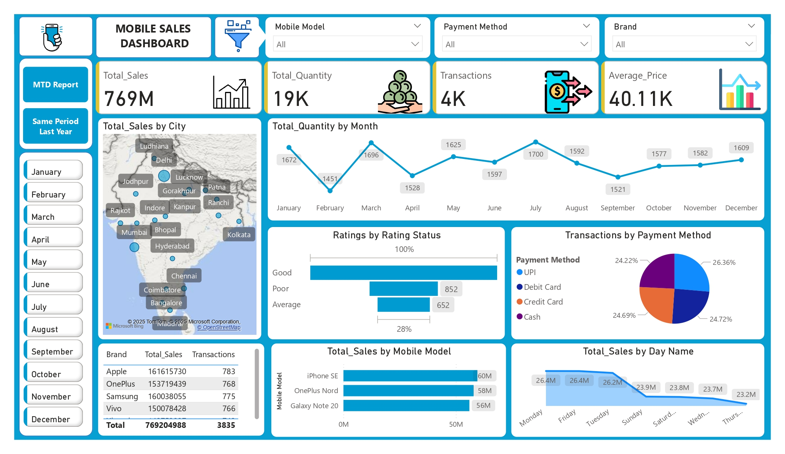
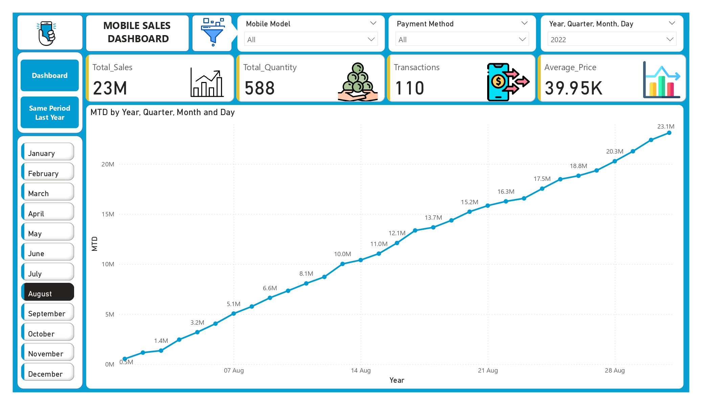
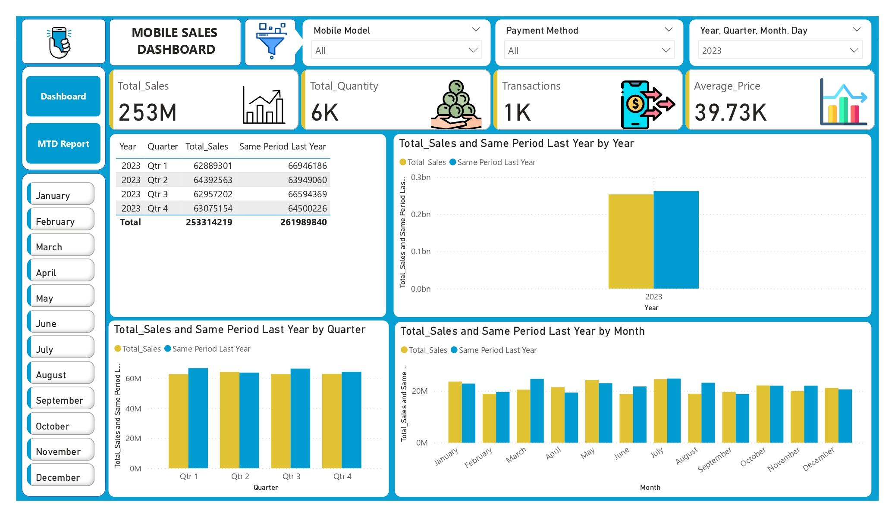

# 📱 Mobile Sales Analysis and Dashboard

**A Data Analysis and Visualization Project**

---

## 📊 Project Overview

This project is an interactive **Mobile Sales Dashboard** created using **Power BI Desktop**. It analyzes and visualizes mobile sales data across different cities, brands, models, months, and payment methods. The dashboard provides deep insights to help businesses and stakeholders make data-driven decisions.

---

## ✅ Key Features

* 📈 **Total Sales, Quantity & Transactions** overview
* 🗓️ Sales trends by **Month, Quarter, and Year**
* 🗺️ Sales distribution across **Cities**
* 🏷️ Insights by **Mobile Brand and Model**
* 💳 Analysis of **Payment Methods** used by customers
* ⭐ **Customer Ratings** distribution
* 📅 Sales performance by **Day of the Week**
* 📊 **Year-over-Year** comparison (Same Period Last Year)
* 🗂️ MTD (Month-to-Date) and YTD (Year-to-Date) reports

---

## 🗂️ Dashboard Visuals

The dashboard includes the following visuals:

* Bar charts for total sales by city and mobile models
* Line/column charts for sales trends by time
* Pie charts for payment method distribution
* KPI cards for total sales, total quantity sold, transactions, and average price
* Map visuals for geospatial analysis
* Rating status visuals to monitor customer satisfaction

---

## 🖼️ Project Screenshots

  Figure 1: Sales Overview Dashboard    
  

 
   Figure 2: MTD by year, quater, day, month    
  

   Figure 3: Year-over-Year Sales Comparison    
  

---

## ⚙️ Tools & Technologies Used

* **Power BI Desktop**
* **SQL**
* **Microsoft Excel / CSV** (for data source, if applicable)
* **DAX** (for custom calculations)
* **Power Query** (for data cleaning and transformation)

---

## 🚀 Insights Derived

Some key insights this dashboard uncovers:

* Top-selling cities and brands.
* Preferred payment methods of customers.
* Monthly and seasonal sales trends.
* Average price analysis by mobile model.
* Customer ratings and feedback.

---

## 📚 Learnings

Through this project, I enhanced my skills in:

* Data cleaning and modeling.
* DAX functions for measures and KPIs.
* Designing effective and interactive dashboards.
* Using visual storytelling to derive actionable insights.

---

## ✨ Author

* **Name:** Piyush Patil
* **LinkedIn:** https://www.linkedin.com/in/piyush-patil-haveachat/
* **GitHub:** https://github.com/PiyushPatil08

